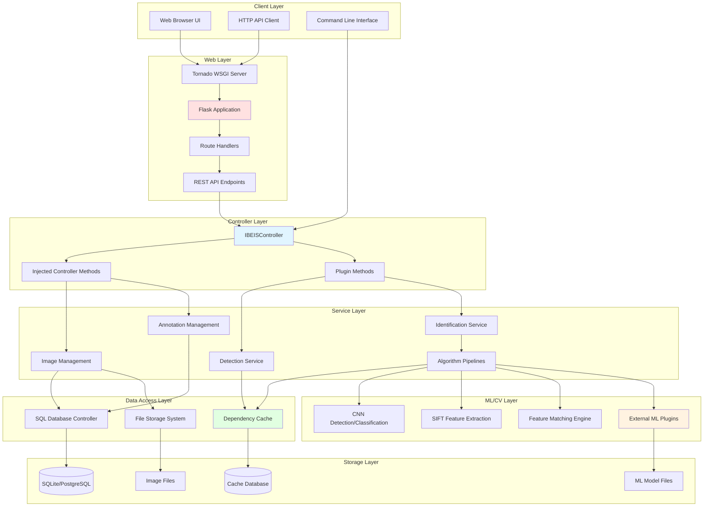
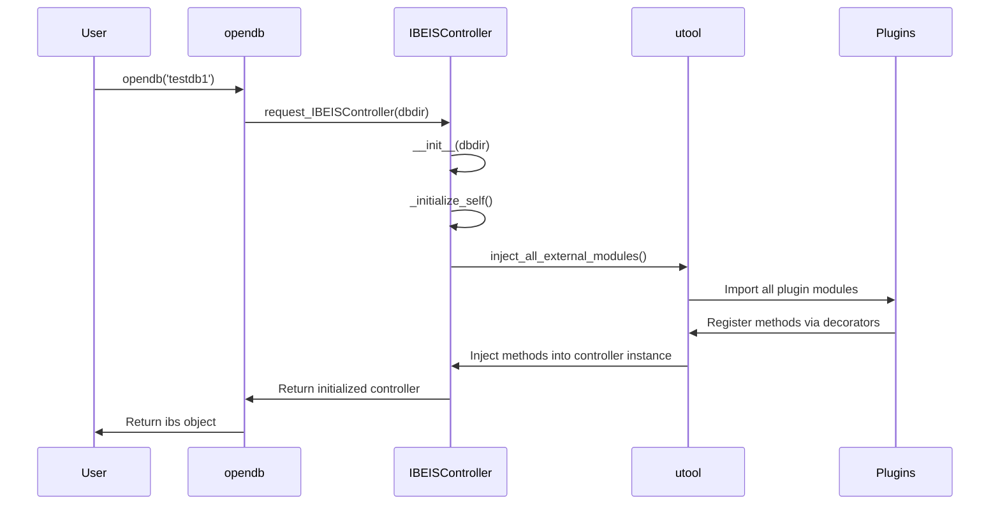
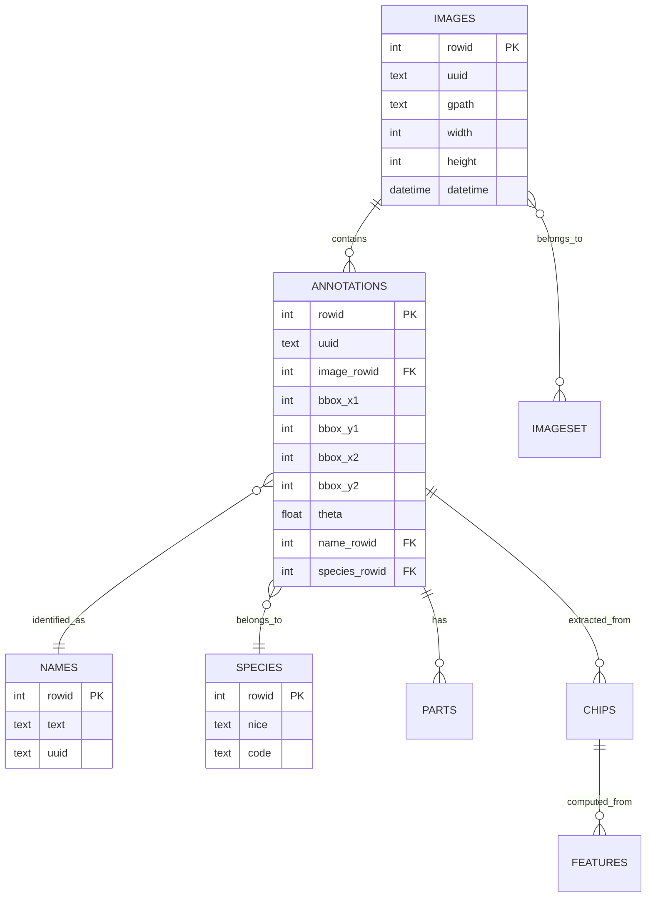
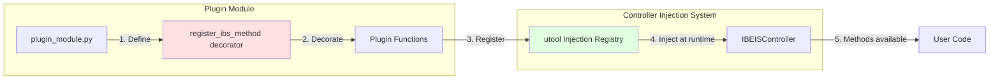
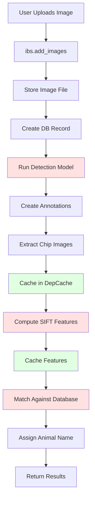
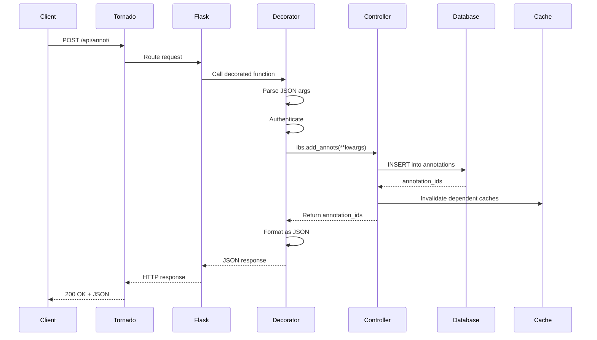
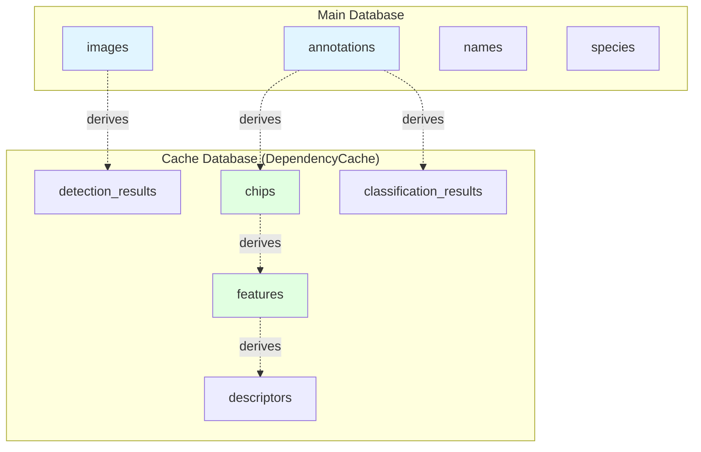
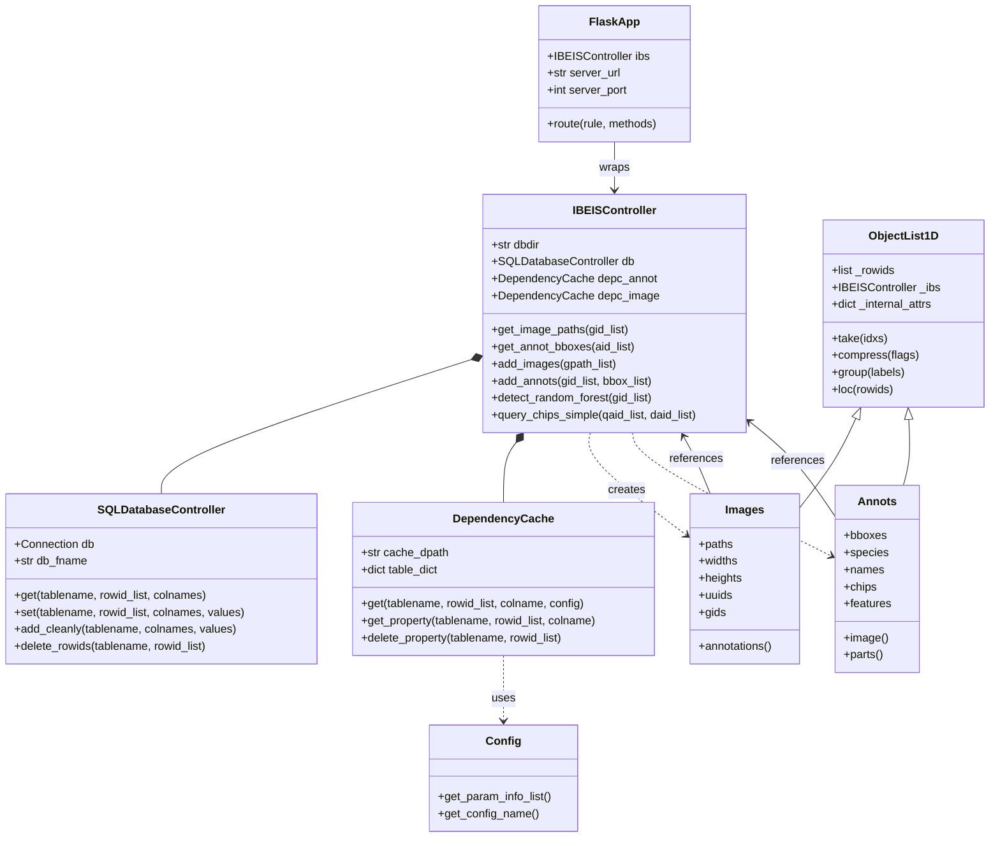

# WBIA Architecture Documentation

**Wildbook Image Analysis (WBIA)** - A Machine Learning system for wildlife conservation

---

## Table of Contents

1. [System Overview](#system-overview)
2. [High-Level Architecture](#high-level-architecture)
3. [Core Components](#core-components)
4. [Plugin System](#plugin-system)
5. [Data Flow](#data-flow)
6. [Database Architecture](#database-architecture)
7. [Web API Layer](#web-api-layer)
8. [Adding New Code](#adding-new-code)
9. [Creating New Plugins](#creating-new-plugins)

---

## System Overview

WBIA is a computer vision and machine learning platform for wildlife identification and tracking. It provides:

- **Animal identification** using keypoint matching and neural networks
- **Species classification** via CNN models
- **Detection and localization** of animals in images
- **RESTful web API** for integration with Wildbook platform
- **Extensible plugin architecture** for adding new ML models

### Technology Stack

| Layer | Technologies |
|-------|-------------|
| **Language** | Python 3.7+ (migrating to 3.12) |
| **Web Framework** | Flask + flask-restx |
| **Web Server** | Tornado (WSGI) |
| **Database** | SQLite (default) / PostgreSQL |
| **Caching** | Custom dependency cache (DependencyCache) |
| **Computer Vision** | OpenCV, PyTorch, NumPy |
| **ML/DL** | PyTorch, TorchVision, CNNs, SIFT descriptors |
| **Meta-programming** | utool (method injection framework) |

---

## High-Level Architecture



---

## Core Components

### 1. IBEISController (`wbia/control/IBEISControl.py`)

The **central hub** of the system. All operations flow through this controller.

```python
from wbia import opendb

# Opens database and initializes controller
ibs = opendb('testdb1')

# All functionality is accessed through the controller
image_paths = ibs.get_image_paths([1, 2, 3])
annotations = ibs.get_annot_bboxes([5, 6, 7])
species = ibs.get_annot_species_texts([5, 6, 7])
```

**Key Responsibilities:**
- Database connection management
- Method injection point (plugins inject methods here)
- Transaction management
- Caching coordination
- Plugin lifecycle management

**Initialization Flow:**



### 2. SQL Database Layer (`wbia/dtool/sql_control.py`)

Provides ORM-like functionality with direct SQL control.

**Core Tables:**
- `images` - Image metadata and file paths
- `annotations` - Animal annotations (bounding boxes)
- `names` - Animal identity names
- `species` - Species information
- `parts` - Animal body parts
- `chips` - Extracted chip images
- `features` - SIFT descriptors
- `imageset` - Image collections

**Schema Diagram:**



### 3. Dependency Cache (`wbia/dtool/depcache_control.py`)

**Purpose:** Caches expensive computed properties with automatic dependency tracking.

**How it works:**
1. Define a computation as a "preprocessor"
2. Declare dependencies (which tables it depends on)
3. Results are cached in a separate database
4. Invalidation happens automatically when dependencies change

**Example:**

```python
from wbia.control.controller_inject import register_preprocs

derived_attribute = register_preprocs['annot']

@derived_attribute(
    tablename='chips',
    parents=['annotations'],
    colnames=['chip', 'width', 'height'],
    coltypes=[('extern', '.png'), int, int],
    configclass=ChipConfig,
)
def compute_chip(depc, aid_list, config=None):
    """Extract chip images from annotations"""
    for aid in aid_list:
        # Expensive operation: extract chip from image
        chip = extract_chip_from_annotation(aid, config)
        yield chip
```

**Benefits:**
- Avoids recomputing expensive operations
- Configuration-aware (different configs = different cache entries)
- Parallel computation support
- Automatic cleanup of stale caches

---

## Plugin System

### Architecture Overview

WBIA uses **dynamic method injection** to extend the controller at runtime. Plugins register methods that become first-class controller methods.



### Plugin Types

#### 1. Internal Plugins (First-Party)

**Location:** `wbia/control/`, `wbia/web/`, `wbia/other/`

**Automatically loaded:** Always available

**Examples:**
- `wbia.control.manual_annot_funcs` - Annotation management
- `wbia.control.manual_image_funcs` - Image management
- `wbia.web.apis_detect` - Detection API endpoints
- `wbia.other.detectfuncs` - Detection utilities

#### 2. External Plugins (Third-Party)

**Location:** Separate PyPI packages (e.g., `wbia-plugin-cnn`)

**Conditionally loaded:** Via command-line flags

**Available plugins:**
- `wbia_cnn` - CNN detection and classification
- `wbia_flukematch` - Whale fluke matching
- `wbia_curvrank_v2` - Curvature ranking for dolphin fins
- `wbia_finfindr` - Dolphin fin identification
- `wbia_pie` - Pose-Invariant Embeddings
- `wbia_orientation` - Animal orientation detection
- `wbia_kaggle7` - Kaggle right whale challenge model

### Plugin Loading Mechanism

**File:** `wbia/control/IBEISControl.py` (lines 60-196)

```python
# Define plugins to load
AUTOLOAD_PLUGIN_MODNAMES = [
    # Internal plugins (always loaded)
    'wbia.annots',
    'wbia.images',
    'wbia.control.manual_image_funcs',
    'wbia.web.apis_detect',

    # External plugins (conditional)
    (('--no-cnn', '--nocnn'), 'wbia_cnn._plugin'),
]

# Loading process
for modname in AUTOLOAD_PLUGIN_MODNAMES:
    if isinstance(modname, tuple):
        flags, modname = modname
        if any(ut.get_argflag(flag) for flag in flags):
            continue  # Skip if disabled
    import_module_from_name(modname)  # Import plugin
```

**Command-line control:**

```bash
# Load all plugins (default)
python -m wbia --web

# Disable CNN plugin
python -m wbia --web --no-cnn

# Enable optional plugin
python -m wbia --web --finfindr
```

---

## Data Flow

### Image Processing Pipeline



### Web API Request Flow



### Identification Query Flow

```mermaid
flowchart LR
    Query[Query Annotation] --> LoadChip[Load Chip Image]
    LoadChip --> LoadFeatures[Load SIFT Features]
    LoadFeatures --> CacheCheck{In Cache?}

    CacheCheck -->|Yes| UseCached[Use Cached Features]
    CacheCheck -->|No| ComputeFeats[Compute Features]
    ComputeFeats --> StoreCache[Store in Cache]
    StoreCache --> UseCached

    UseCached --> BuildIndex[Build/Load NN Index]
    BuildIndex --> QueryIndex[Query ANN Index]
    QueryIndex --> RankResults[Rank by Score]
    RankResults --> Return[Return Top Matches]

    style ComputeFeats fill:#ffe1e1
    style CacheCheck fill:#e1ffe1
```



---

## Database Architecture

### Dual Database System

WBIA uses two separate databases:

1. **Main Database** (`_wbia_database.sqlite3`)
   - Core entity storage (images, annotations, names)
   - Metadata and relationships
   - User data and configuration

2. **Cache Database** (`_wbia_cache.sqlite3`)
   - Computed properties (chips, features, descriptors)
   - ML model outputs
   - Indexed search structures

**Why separate databases?**
- Cache can be deleted/rebuilt without data loss
- Different backup strategies
- Performance isolation
- Easier migration and testing

### Table Relationships



---

## Web API Layer

### Flask Application Structure

**File:** `wbia/web/app.py`

```python
def start_from_wbia(ibs, port=5000, **kwargs):
    """Main entry point for web server"""
    app = get_flask_app()
    app.ibs = ibs  # Attach controller to Flask app

    # Initialize extensions
    from wbia.web import extensions, modules
    extensions.init_app(app)
    modules.init_app(app)

    # Wrap with Tornado WSGI
    wsgi_container = TimedWSGIContainer(app)
    http_server = tornado.httpserver.HTTPServer(wsgi_container)
    http_server.listen(port)

    # Start event loop
    tornado.ioloop.IOLoop.instance().start()
```

### API Registration Pattern

Plugins can register both **controller methods** AND **Flask routes** simultaneously:

```python
from wbia.control import controller_inject

CLASS_INJECT_KEY, register_ibs_method = \
    controller_inject.make_ibs_register_decorator(__name__)

register_api = controller_inject.get_wbia_flask_api(__name__)

@register_ibs_method
@register_api('/api/image/<rowid>/', methods=['GET'])
def get_image_info(ibs, rowid=None, **kwargs):
    """
    Get image information

    Accessible as:
    1. Python: ibs.get_image_info(rowid=123)
    2. HTTP: GET /api/image/123/
    """
    return {
        'image_id': rowid,
        'path': ibs.get_image_paths(rowid),
        'width': ibs.get_image_widths(rowid),
        'height': ibs.get_image_heights(rowid),
    }
```

### API Endpoint Categories

| Prefix | Purpose | Example |
|--------|---------|---------|
| `/api/core/` | Core database operations | `/api/core/db/info/` |
| `/api/image/` | Image management | `/api/image/src/<id>/` |
| `/api/annot/` | Annotation operations | `/api/annot/bbox/<id>/` |
| `/api/detect/` | Detection models | `/api/detect/cnn/` |
| `/api/query/` | Identification queries | `/api/query/chips/simple/` |
| `/api/engine/` | Job management | `/api/engine/job/status/` |

---

## Adding New Code

### Adding a New Controller Method

**Step 1:** Choose appropriate module in `wbia/control/`

**Step 2:** Create your function with the decorator pattern

```python
# File: wbia/control/manual_animal_funcs.py

from wbia.control import controller_inject

CLASS_INJECT_KEY, register_ibs_method = \
    controller_inject.make_ibs_register_decorator(__name__)

@register_ibs_method
def get_animal_age_estimates(ibs, aid_list):
    """
    Estimate ages of animals in annotations

    Args:
        ibs (IBEISController): controller instance
        aid_list (list): list of annotation IDs

    Returns:
        list: estimated ages in years
    """
    # Your implementation here
    ages = []
    for aid in aid_list:
        # Logic to estimate age
        age = estimate_age_from_annotation(ibs, aid)
        ages.append(age)
    return ages
```

**Step 3:** Add module to `AUTOLOAD_PLUGIN_MODNAMES` in `wbia/control/IBEISControl.py`

```python
AUTOLOAD_PLUGIN_MODNAMES = [
    # ... existing modules ...
    'wbia.control.manual_animal_funcs',  # Add your module
]
```

**Step 4:** Use your new method

```python
import wbia
ibs = wbia.opendb('testdb1')
ages = ibs.get_animal_age_estimates([1, 2, 3])
print(ages)  # [2.5, 3.1, 1.8]
```

### Adding a Cached Computed Property

For expensive computations that should be cached:

```python
# File: wbia/core_annots.py

from wbia.control.controller_inject import register_preprocs
from wbia import dtool

derived_attribute = register_preprocs['annot']

class AnimalAgeConfig(dtool.Config):
    def get_param_info_list(self):
        return [
            ut.ParamInfo('method', 'ml_model'),
            ut.ParamInfo('version', '1.0'),
        ]

@derived_attribute(
    tablename='animal_age',
    parents=['annotations'],
    colnames=['estimated_age', 'confidence'],
    coltypes=[float, float],
    configclass=AnimalAgeConfig,
    fname='age_estimates',
)
def compute_animal_age(depc, aid_list, config=None):
    """
    Compute and cache age estimates

    Args:
        depc (DependencyCache): dependency cache object
        aid_list (list): annotation IDs
        config (AnimalAgeConfig): configuration

    Yields:
        tuple: (estimated_age, confidence) for each annotation
    """
    ibs = depc.controller
    for aid in aid_list:
        # Expensive ML inference
        age, confidence = run_age_model(ibs, aid, config)
        yield (age, confidence)
```

**Usage:**

```python
# Access through dependency cache
depc = ibs.depc_annot
ages = depc.get('animal_age', [1, 2, 3], 'estimated_age')

# Or via accessor (if defined)
ages = ibs.get_annot_age_estimates([1, 2, 3])
```

### Adding a Web API Endpoint

Combine both decorators:

```python
# File: wbia/web/apis_animals.py

from wbia.control import controller_inject

CLASS_INJECT_KEY, register_ibs_method = \
    controller_inject.make_ibs_register_decorator(__name__)

register_api = controller_inject.get_wbia_flask_api(__name__)

@register_ibs_method
@register_api('/api/animal/age/', methods=['GET'])
def api_get_animal_ages(ibs, aid_list=None, **kwargs):
    """
    RESTful endpoint: GET /api/animal/age/?aid_list=[1,2,3]

    Args:
        aid_list (list): annotation IDs

    Returns:
        dict: JSON response with ages
    """
    ages = ibs.get_animal_age_estimates(aid_list)
    return {
        'ages': ages,
        'aid_list': aid_list,
    }
```

**Test your endpoint:**

```bash
curl "http://localhost:5000/api/animal/age/?aid_list=[1,2,3]"
# Response: {"ages": [2.5, 3.1, 1.8], "aid_list": [1, 2, 3]}
```

---

## Creating New Plugins

### External Plugin Structure

```
wbia-plugin-mymodel/
├── setup.py
├── requirements.txt
├── README.md
├── wbia_mymodel/
│   ├── __init__.py
│   ├── _plugin.py          # Main plugin file
│   ├── models.py            # ML model implementation
│   └── config.py            # Configuration classes
└── tests/
    └── test_plugin.py
```

### Plugin Template

**File:** `wbia_mymodel/_plugin.py`

```python
"""
WBIA Plugin: MyModel
Animal identification using MyModel algorithm
"""
import logging
import utool as ut
from wbia.control import controller_inject

logger = logging.getLogger('wbia')

# Create registration decorator
CLASS_INJECT_KEY, register_ibs_method = \
    controller_inject.make_ibs_register_decorator(__name__)

register_api = controller_inject.get_wbia_flask_api(__name__)


@register_ibs_method
def mymodel_identify(ibs, aid_list, config=None):
    """
    Identify animals using MyModel

    Args:
        ibs (IBEISController): controller
        aid_list (list): annotation IDs to identify
        config (dict): algorithm configuration

    Returns:
        list: identification results
    """
    from wbia_mymodel import models

    # Load model
    model = models.load_mymodel()

    # Get images for annotations
    chip_paths = ibs.get_annot_chip_fpath(aid_list)

    # Run inference
    results = []
    for chip_path in chip_paths:
        result = model.predict(chip_path, config)
        results.append(result)

    return results


@register_ibs_method
@register_api('/api/plugin/mymodel/identify/', methods=['POST'])
def mymodel_identify_api(ibs, aid_list=None, config=None, **kwargs):
    """
    RESTful API: POST /api/plugin/mymodel/identify/

    Body: {"aid_list": [1, 2, 3], "config": {...}}
    """
    results = ibs.mymodel_identify(aid_list, config=config)
    return {
        'results': results,
        'success': True,
    }


# Plugin metadata
def get_plugin_info():
    return {
        'name': 'MyModel',
        'version': '1.0.0',
        'description': 'Animal identification using MyModel',
        'author': 'Your Name',
    }
```

### Setup Configuration

**File:** `setup.py`

```python
from setuptools import setup, find_packages

setup(
    name='wbia-plugin-mymodel',
    version='1.0.0',
    description='WBIA Plugin: MyModel',
    author='Your Name',
    packages=find_packages(),
    install_requires=[
        'wbia',
        'torch>=1.9.0',
        'torchvision>=0.10.0',
    ],
    python_requires='>=3.7',
)
```

### Registering Your Plugin

**Option 1:** Add to `AUTOLOAD_PLUGIN_MODNAMES` (requires forking WBIA)

```python
# In wbia/control/IBEISControl.py
if ut.get_argflag('--mymodel'):
    AUTOLOAD_PLUGIN_MODNAMES += [
        (('--no-mymodel', '--nomymodel'), 'wbia_mymodel._plugin'),
    ]
```

**Option 2:** Manual import in user code

```python
import wbia
import wbia_mymodel._plugin  # Import to trigger registration

ibs = wbia.opendb('testdb1')
results = ibs.mymodel_identify([1, 2, 3])
```

### Plugin Best Practices

1. **Naming Convention:** `wbia-plugin-<name>` or `wbia_<name>`
2. **Entry Point:** Always create `_plugin.py` with registration
3. **Testing:** Include tests that work with `testdb1`
4. **Documentation:** Document API methods with clear examples
5. **Configuration:** Use `dtool.Config` for algorithm parameters
6. **Caching:** Use `register_preprocs` for expensive computations
7. **Dependencies:** Minimize external dependencies
8. **Error Handling:** Graceful degradation if models not available

### Example Plugins to Study

| Plugin | Repository | Use Case |
|--------|-----------|----------|
| CNN | `WildMeOrg/wbia-plugin-cnn` | Detection & classification |
| Flukematch | `WildMeOrg/wbia-plugin-flukematch` | Whale fluke matching |
| PIE | `WildMeOrg/wbia-plugin-pie` | Pose-invariant embeddings |
| CurvRank | `WildMeOrg/wbia-plugin-curvrank-v2` | Dolphin fin ranking |

---

## Project Structure Reference

```
wildbook-ia/
├── wbia/                           # Main package
│   ├── __init__.py                 # Package initialization
│   ├── _wbia_object.py             # Base object classes (ObjectList1D, etc.)
│   ├── entry_points.py             # CLI entry points (opendb, main)
│   ├── constants.py                # Global constants
│   ├── params.py                   # Command-line argument parsing
│   │
│   ├── control/                    # Controller and plugins
│   │   ├── IBEISControl.py         # Main controller class
│   │   ├── controller_inject.py    # Plugin injection system
│   │   ├── manual_*.py             # Core controller methods
│   │   └── docker_control.py       # Docker utilities
│   │
│   ├── dtool/                      # Database tools
│   │   ├── sql_control.py          # SQL database controller
│   │   ├── depcache_control.py     # Dependency cache
│   │   ├── depcache_table.py       # Cache table management
│   │   └── base.py                 # Config, Result classes
│   │
│   ├── algo/                       # Algorithms
│   │   ├── hots/                   # HotSpotter (SIFT matching)
│   │   ├── detect/                 # Detection algorithms
│   │   ├── graph/                  # Graph algorithms
│   │   └── preproc/                # Preprocessing
│   │
│   ├── web/                        # Web interface
│   │   ├── app.py                  # Flask app initialization
│   │   ├── apis*.py                # API endpoint modules
│   │   ├── routes*.py              # Web page routes
│   │   ├── appfuncs.py             # Helper functions
│   │   ├── job_engine.py           # Background job processing
│   │   ├── templates/              # Jinja2 templates
│   │   └── static/                 # CSS, JS, images
│   │
│   ├── core_annots.py              # Annotation objects
│   ├── core_images.py              # Image objects
│   ├── core_parts.py               # Part objects
│   │
│   ├── init/                       # Initialization
│   │   ├── main_helpers.py         # Helper functions
│   │   └── sysres.py               # System resources
│   │
│   ├── dbio/                       # Database I/O
│   │   ├── ingest_*.py             # Import from other formats
│   │   └── export_*.py             # Export to other formats
│   │
│   ├── other/                      # Miscellaneous
│   │   ├── detectfuncs.py          # Detection functions
│   │   └── ibsfuncs.py             # IBS utilities
│   │
│   ├── gui/                        # Qt GUI (optional)
│   ├── viz/                        # Visualization
│   ├── templates/                  # Code templates
│   └── tests/                      # Test suite
│
├── devops/                         # Docker and deployment
│   ├── Dockerfile                  # Multi-stage Docker build
│   └── build.sh                    # Build script
│
├── requirements/                   # Dependency specifications
├── setup.py                        # Package setup
├── pyproject.toml                  # Modern Python packaging
└── README.rst                      # Project documentation
```

---

## Development Workflow

### Setting Up Development Environment

```bash
# Clone repository
git clone https://github.com/WildMeOrg/wildbook-ia.git
cd wildbook-ia

# Create virtual environment
python -m venv venv
source venv/bin/activate  # or `venv\Scripts\activate` on Windows

# Install in development mode
pip install -e .

# Install development dependencies
pip install -r requirements/development.txt

# Install pre-commit hooks
pre-commit install
```

### Running the System

```bash
# Command-line interface
python -m wbia

# Start with test database
python -m wbia --db testdb1

# Start web server
python -m wbia --web --port 5000

# Start with specific plugins
python -m wbia --web --cnn --finfindr

# Disable plugins
python -m wbia --web --no-cnn
```

### Testing

```bash
# Run all tests
pytest

# Run specific test module
pytest wbia/tests/test_annots.py

# Run with web tests (requires running server)
pytest --web-tests

# Run doctests
pytest --xdoctest
```

### Code Quality

```bash
# Format code
brunette --config=setup.cfg .

# Sort imports
isort --settings-path setup.cfg .

# Lint code
flake8

# Run all pre-commit hooks
pre-commit run --all-files
```

---

## UML Class Diagram



---

## Key Design Patterns

### 1. Controller Pattern
- Single point of access (`IBEISController`)
- All operations go through controller
- Consistent API across modules

### 2. Repository Pattern
- `SQLDatabaseController` abstracts database access
- Controllers don't write SQL directly
- Easy to swap database backends

### 3. Decorator Pattern
- `@register_ibs_method` for plugin registration
- `@register_api` for Flask routes
- `@derived_attribute` for cached properties

### 4. Strategy Pattern
- Configurable algorithms via `Config` classes
- Plugin system allows algorithm swapping
- Dependency cache supports multiple configurations

### 5. Lazy Loading
- Modules imported on demand
- Plugins loaded conditionally
- Caches computed only when accessed

---

## Performance Considerations

### Caching Strategy

1. **Hot Path:** Frequently accessed data stays in memory
2. **Warm Path:** Computed properties cached in DependencyCache
3. **Cold Path:** Raw data fetched from disk on demand

### Parallelization

- **Multi-processing:** For CPU-bound tasks (feature extraction)
- **Async I/O:** For web requests and database queries
- **Batch Operations:** Vectorized operations where possible

### Database Optimization

- **Indexing:** Primary keys and foreign keys indexed
- **Prepared Statements:** SQL queries use parameterized queries
- **Connection Pooling:** Reuse database connections
- **Transaction Batching:** Bulk inserts for large operations

---

## Security Considerations

- **SQL Injection:** Parameterized queries throughout
- **Path Traversal:** File paths validated
- **Authentication:** Optional CAS/OAuth integration
- **API Rate Limiting:** Configurable request throttling
- **Input Validation:** JSON schema validation for API requests

---

## Deployment

### Docker Deployment

```bash
# Build image
docker build -t wildbook-ia .

# Run container
docker run -p 5000:5000 -v /data:/data/db wildbook-ia

# Docker Compose
docker-compose up
```

### Production Configuration

- Use PostgreSQL instead of SQLite for multi-user
- Enable HTTPS with SSL certificates
- Configure Nginx as reverse proxy
- Set up periodic database backups
- Monitor with Prometheus/Grafana

---

## References

- **Project Repository:** https://github.com/WildMeOrg/wildbook-ia
- **Documentation:** https://wildmeorg.github.io/wildbook-ia/
- **Wildbook Platform:** https://github.com/WildMeOrg/
- **Original IBEIS:** https://github.com/Erotemic/ibeis
- **HotSpotter:** http://cs.rpi.edu/hotspotter/

---

**Last Updated:** 2024-09-30
**WBIA Version:** 5.x (Python 3.12 migration)